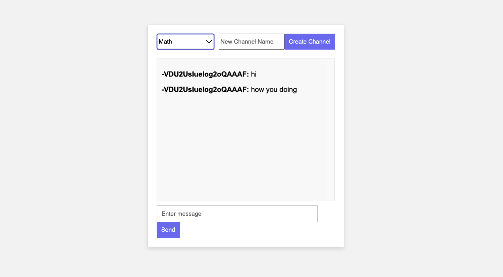

## Problem Statement:

Develop a multi-channel chat application with the following features:
• Channel Creation: Users should be able to create new chat channels.
• Channel Selection: Users should be able to select and join different chat channels.
• Real-time Messaging: Messages sent by users should be displayed in real-time to all users within the same channel.
• User Interface: Create a user-friendly interface with options for channel selection, message input, and message display.

## Additional Resources:

• Refer to Socket.IO documentation for real-time communication.
• Explore React.js for building the frontend user

## screenshots

